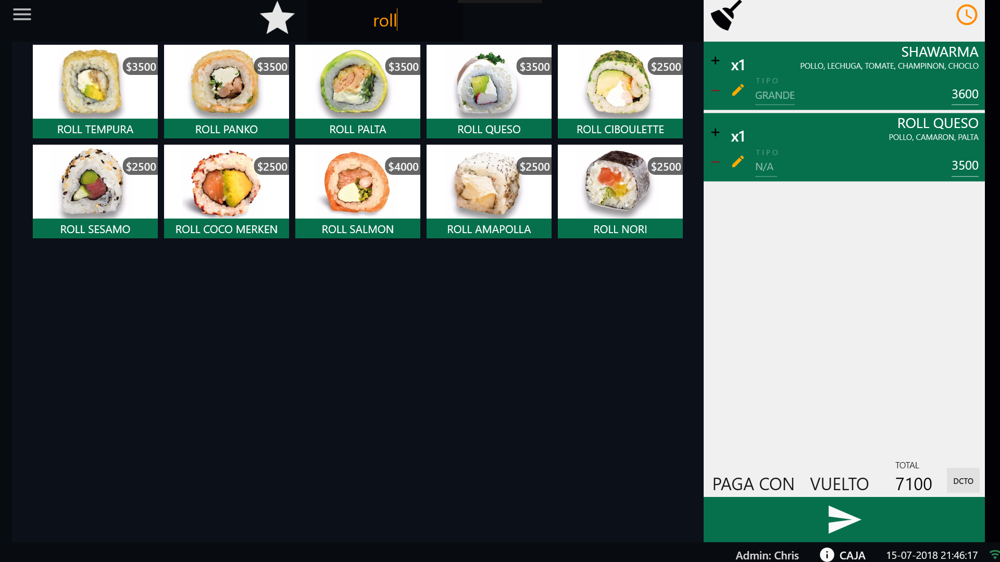

# Posk Point of Sale
Desktop application written in C# oriented to touch devices

# Quick Demo

- Client/cashier and kitchen thermal print copies are shown in notepad for demo purposes only

- Bar: https://www.youtube.com/watch?v=Uvtj2vukWZI

# Making of
- Some client requested a feature to customize products selection, I mspaint draw the requirements and code it all night, next day we started testing for production: https://youtu.be/eXSwujbNzJk
- Queue counter: https://youtu.be/cuwabvXYx10
- Associate sell to client: https://youtu.be/Z_fvmWIUIlU
- Pay with, change and more: https://youtu.be/CfaI0ZTo3CM

# Screenshots
- Main UI

- Open categories (left) or pendings queue (right) with a swipe gesture

- Login with a secret tap sequence on the user's photo

- Working hours data (cash sells, losses, tips, etc)

- Product builder

- Second part of product builder: Select between its available ingredients

- Restaurant sectors and tables

- Some modules or features:

1. Email to the owner after closing working hours
2. Client app to request something without a waiter that prints a kitchen voucher instantly
3. Watch and manage the step 2 requests

# Pproduction demo
- Sushi: https://www.youtube.com/watch?v=E9_BYEc99Mk
- Bar: https://www.youtube.com/watch?v=10zwXxgYUG8

# Website
Website doesn't exists anymore since I turned Posk open source back in 2018

- Page 1: Home

- Page 2: Notifications

- Page 3: Example, if buying a hotdog, bread and sausage are discounted from stock

